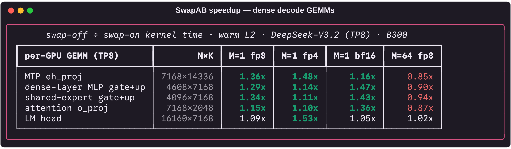
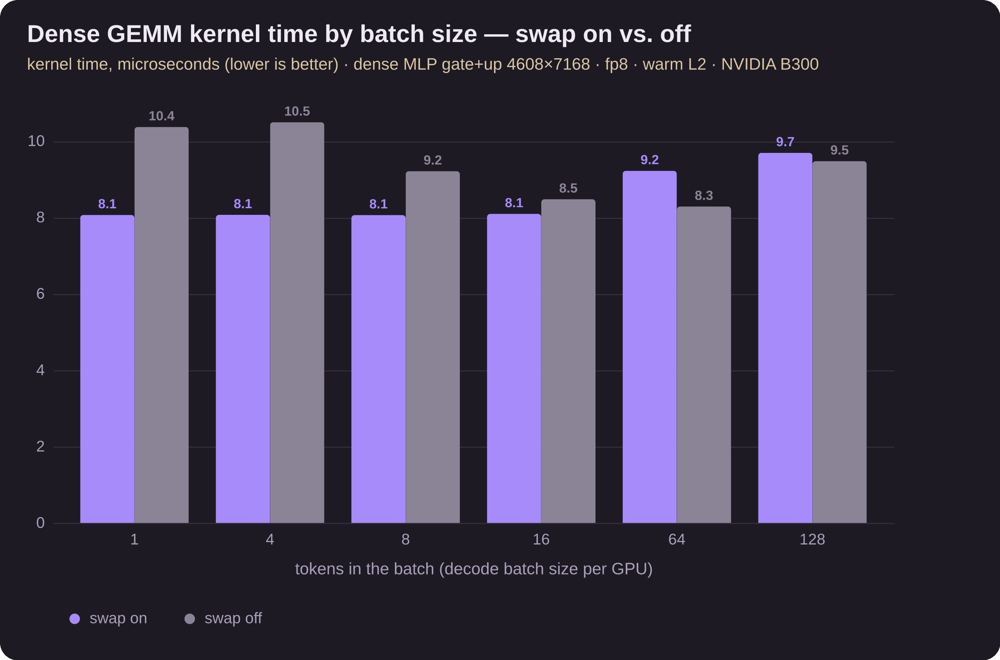
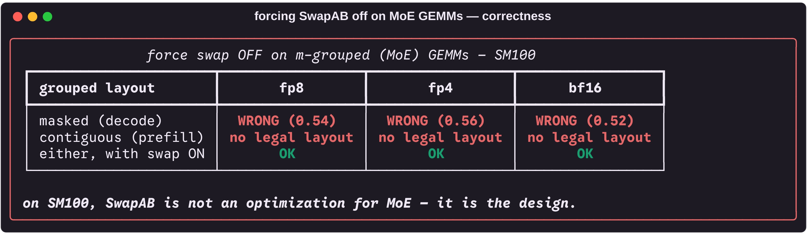

# deepgemm-swapab-bench

> **Sources.** The code facts in this document are drawn from (and verified
> against, at the exact lines cited):
> [sgl-project/DeepGEMM](https://github.com/sgl-project/DeepGEMM) @ `a348cd9`
> (SGLang's fork of [deepseek-ai/DeepGEMM](https://github.com/deepseek-ai/DeepGEMM)) ·
> [NVIDIA PTX ISA](https://docs.nvidia.com/cuda/parallel-thread-execution/)
> (`tcgen05.mma`, `tcgen05.ld`, `stmatrix`, TMA) ·
> [CUTLASS Blackwell functionality docs](https://github.com/NVIDIA/cutlass/blob/main/media/docs/cpp/blackwell_functionality.md) ·
> the [DeepSeek-V3.2 checkpoint](https://huggingface.co/deepseek-ai/DeepSeek-V3.2)
> (shapes read from its safetensors headers) ·
> [sglang](https://github.com/sgl-project/sglang) model code (TP sharding).
> All measurements are original: NVIDIA **B300 (sm_103)**, CUPTI hardware-counter
> timing, every configuration correctness-checked before it is timed
> (full raw captures in [`logs/`](logs/)).

<p align="center"></p>
<p align="center"></p>

SwapAB — computing **Bᵀ·Aᵀ = Cᵀ** instead of **A·B = C** — looks mathematically
trivial. On paper `(AB)ᵀ = BᵀAᵀ` is a one-line identity; on an ideal GPU where
A and B are treated symmetrically it would change nothing. On **SM100
(Blackwell)** it is a load-bearing hack that works around real hardware
asymmetry in the tensor core (`tcgen05.mma`), the accumulator memory (TMEM),
and TMA — and this repo measures exactly what it buys, on the production GEMM
shapes of [DeepSeek-V3.2](https://huggingface.co/deepseek-ai/DeepSeek-V3.2)
serving, in **FP8, FP4-weight, and BF16**, in
[DeepGEMM](https://github.com/sgl-project/DeepGEMM).

## TL;DR — three measured facts

**1. For MoE (m-grouped) GEMMs on SM100, SwapAB is not an optimization — it is
mandatory.** DeepGEMM hard-codes `swap_ab = true` for every m-grouped GEMM
([`sm100.hpp:31-43`](https://github.com/sgl-project/DeepGEMM/blob/a348cd95a8ddfd3ef337b595d8e8b841c0d9cf0f/csrc/jit_kernels/heuristics/sm100.hpp#L31-L43)).
We patched the heuristic to force it off anyway:

| grouped GEMM, swap forced OFF | fp8 | fp4 | bf16 |
|---|---|---|---|
| masked layout (decode) | **WRONG RESULTS** (rel-diff ≈ 0.5) | WRONG RESULTS | WRONG RESULTS |
| contiguous layout (prefill) | **no legal layout exists** | no legal layout | no legal layout |

The scheduler's effective-M machinery exists "for swap A/B and psum layout
only" ([`scheduler/gemm.cuh:162`](https://github.com/sgl-project/DeepGEMM/blob/a348cd95a8ddfd3ef337b595d8e8b841c0d9cf0f/deep_gemm/include/deep_gemm/scheduler/gemm.cuh#L162)),
and the contiguous format aligns group boundaries to **240 rows** — a multiple
of the 16-row UMMA-N step, not of any legal non-swap `BLOCK_M` (32/64/128).
Even the *memory layout* of grouped GEMMs is swap-native.

<p align="center"></p>

**2. For dense decode GEMMs, SwapAB is what the heuristic picks at M ≤ 16 on
almost every DeepSeek-V3.2 shape, and it is worth up to 1.5x when the kernel
is not purely HBM-bound.** Warm-L2 kernel time, swap-off ÷ swap-on:

| per-GPU GEMM (TP8) | N×K | M=1 fp8 | M=1 fp4 | M=1 bf16 | M=64 fp8 |
|---|---|---:|---:|---:|---:|
| MTP `eh_proj` | 7168×14336 | **1.36x** | **1.48x** | 1.16x | 0.85x |
| dense-layer MLP gate+up | 4608×7168 | **1.29x** | 1.14x | **1.47x** | 0.90x |
| shared-expert gate+up | 4096×7168 | **1.34x** | 1.11x | **1.43x** | 0.94x |
| attention `o_proj` | 7168×2048 | 1.15x | 1.10x | **1.36x** | 0.87x |
| LM head | 16160×7168 | 1.09x | **1.53x** | 1.05x | 1.02x |

The crossover is real: past M≈32 the swapped layout starts *losing* (0.85-0.94x
at M=64), which is exactly where the heuristic changes block sizes. With a
**cold L2** (weights streamed from HBM every time — the realistic decode
condition) both variants are equally memory-bound and essentially tie at
decode sizes (fp8, M ≤ 8: 0.94-1.05x across these shapes): SwapAB's
compute-side win is hidden behind DRAM latency there, and it costs nothing.

**3. TMA multicast — which the cluster geometry only permits in the swapped
layout — is worth up to 1.24x on MoE prefill, and nothing at decode sizes.**
m-grouped contiguous, 32 experts per GPU, no-multicast ÷ multicast:

| tokens/expert | gate+up fp8 | gate+up fp4 | gate+up bf16 | down fp8 | down fp4 | down bf16 |
|---:|---:|---:|---:|---:|---:|---:|
| 32 | 1.09x | 1.27x | 1.10x | 1.02x | 1.20x | 1.06x |
| 512 | **1.23x** | **1.24x** | **1.20x** | 1.18x | 1.19x | 1.13x |
| 1-32 (masked, decode) | ~1.00x | ~1.00x | ~1.00x | ~1.00x | ~1.00x | ~1.00x |

<p align="center"></p>

Bonus observation from the same runs: on the weight-bound decode MoE shapes,
FP4 weights beat FP8 by the bandwidth you'd hope for — 160.5 µs → 96.0 µs
(gate+up) and 90.7 µs → 55.2 µs (down) at 8 tokens/expert, ≈ **1.65x**.

Everything is reproducible: `run.sh` clones the fork, applies the two-knob
patch in [`patches/`](patches/), builds, and reruns the whole matrix. Raw CSVs
and full logs (including every `DG_PRINT_CONFIGS` layout decision) are in
[`logs/`](logs/).

---

## 1. Why SwapAB exists: the hardware is not symmetric in A and B

On an ideal GPU, `D = A·B` treats its operands symmetrically and a library
would never care which one you call "A". On SM100 they are not symmetric, in
three ways that compound:

**The tensor core's M is rigid; its N is flexible.** Blackwell's matrix
engine, `tcgen05.mma` (called **UMMA** in CUTLASS terminology), reads operand A
and operand B tiles from shared memory and accumulates into **TMEM** — a
dedicated 256 KB per-SM tensor memory organized as **128 lanes (rows) ×
columns**, with lanes hard-wired to the M dimension of the instruction and
columns allocated along N. For the block-scaled `mxf8f6f4` kind DeepGEMM uses
on SM100, the instruction's shape is tied to that TMEM footprint, and the
kernel's own static assert states the rule exactly
([`sm100_fp8_fp4_gemm_1d1d.cuh:297-299`](https://github.com/sgl-project/DeepGEMM/blob/a348cd95a8ddfd3ef337b595d8e8b841c0d9cf0f/deep_gemm/include/deep_gemm/impls/sm100_fp8_fp4_gemm_1d1d.cuh#L297-L299)):

```c++
DG_STATIC_ASSERT((UMMA_M == 64  and UMMA_N %  8 == 0 and  8 <= UMMA_N and UMMA_N <= 256) or
                 (UMMA_M == 128 and UMMA_N % 16 == 0 and 16 <= UMMA_N and UMMA_N <= 256) or
                 (UMMA_M == 256 and UMMA_N % 16 == 0 and 16 <= UMMA_N and UMMA_N <= 256),
                 "Invalid MMA instruction shape");
```

DeepGEMM's SM100 layouts use `UMMA_M = 128` per CTA (256 for a 2-CTA pair) —
fixed — while `UMMA_N` may be any multiple of 16 up to 256
([`:50-51`](https://github.com/sgl-project/DeepGEMM/blob/a348cd95a8ddfd3ef337b595d8e8b841c0d9cf0f/deep_gemm/include/deep_gemm/impls/sm100_fp8_fp4_gemm_1d1d.cuh#L50-L51)):

```c++
constexpr uint32_t UMMA_M = LAYOUT_AD_M * kNumMulticast;   // fixed: 128, or 256 for 2-SM
constexpr uint32_t UMMA_N = kSwapAB ? BLOCK_M : BLOCK_N;   // flexible, steps of 16
```

**Here is the problem.** A decode-time GEMM has *tiny M* (M = tokens in the
batch, 1-16) and large N (the weight matrix's output dim). Without swapping,
those M rows sit on the UMMA **M** axis: the instruction still spans a
128-lane TMEM footprint, and with M=16 you are lighting up 16 of 128 lanes —
the tensor core issues 8x the useful work. Your M is too small for the rigid
axis; your N is fine.

**SwapAB: compute `Bᵀ·Aᵀ` instead.** Now the weight dim N (thousands) sits on
the rigid 128-lane axis and fills it completely, while the tiny token count
sits on the flexible axis as `UMMA_N = 16`. The kernel even *re-sizes UMMA_N
dynamically per block* to the actual number of valid tokens
([`:329-331`](https://github.com/sgl-project/DeepGEMM/blob/a348cd95a8ddfd3ef337b595d8e8b841c0d9cf0f/deep_gemm/include/deep_gemm/impls/sm100_fp8_fp4_gemm_1d1d.cuh#L329-L331)):

```c++
// Dynamic update of UMMA N based on effective M, when swap-AB is enabled
if constexpr (kSwapAB) {
    uint32_t umma_n = scheduler.get_aligned_effective_m_in_block(m_block_idx);
    mma::sm100::update_instr_desc_with_umma_n(instr_desc, umma_n);
}
```

M=7 tokens? `UMMA_N = 16` (the minimum step), not 128. The waste drops from
8x to ~2x — and the flexible axis can right-size where the rigid one cannot.

## 2. What actually flips when `kSwapAB` is on

SwapAB is **not** "swap two pointers". Six distinct things change, spread
across the heuristic, the TMA setup, the MMA issue path, and the epilogue.

### 2.1 The instruction descriptor flips dtypes and majorness

([`:283-286`](https://github.com/sgl-project/DeepGEMM/blob/a348cd95a8ddfd3ef337b595d8e8b841c0d9cf0f/deep_gemm/include/deep_gemm/impls/sm100_fp8_fp4_gemm_1d1d.cuh#L283-L286))
— note the argument order `b, a` and `kMajorB, kMajorA` in the swapped branch:

```c++
auto instr_desc = kSwapAB ? cute::UMMA::make_instr_desc_block_scaled<b_dtype_t, a_dtype_t, float, cutlass::float_ue8m0_t,
                                                                     UMMA_M, UMMA_N, kMajorB, kMajorA>()
                          : cute::UMMA::make_instr_desc_block_scaled<a_dtype_t, b_dtype_t, float, cutlass::float_ue8m0_t,
                                                                     UMMA_M, UMMA_N, kMajorA, kMajorB>();
```

This is why the FP4 case works at all: in the a8w4 recipe the FP4 operand is
B (the weights), but after the swap it is fed to the instruction's *A* port,
so the descriptor must carry the dtypes in swapped order too.

### 2.2 The MMA is issued with B's descriptor in the A slot

B still lands in `smem_b` — the TMA descriptors and loads are built from each
tensor's own GMEM layout — but at issue time the *shared-memory descriptors*
cross over, and so do the scale-factor TMEM columns (UTCCP copies the UE8M0
scales from SMEM into TMEM; SFA/SFB ids swap with their operands)
([`:375-386`](https://github.com/sgl-project/DeepGEMM/blob/a348cd95a8ddfd3ef337b595d8e8b841c0d9cf0f/deep_gemm/include/deep_gemm/impls/sm100_fp8_fp4_gemm_1d1d.cuh#L375-L386)):

```c++
const auto runtime_instr_desc = kSwapAB ?
    mma::sm100::make_runtime_instr_desc_with_sf_id(instr_desc, sfb_id, sfa_id):
    mma::sm100::make_runtime_instr_desc_with_sf_id(instr_desc, sfa_id, sfb_id);
...
if constexpr (kSwapAB) {
    mma_t::fma(b_desc, a_desc, accum_stage_idx * UMMA_N, ...);   // B as operand A
} else {
    mma_t::fma(a_desc, b_desc, accum_stage_idx * UMMA_N, ...);
}
```

where `mma_t` is `ptx::SM100_MMA_MXF8F6F4_SS` (or the `2x1SM` variant for
2-CTA clusters). From this point on, **TMEM is accumulating Cᵀ**, not C:
128 lanes of weight-dim, UMMA_N columns of tokens.

### 2.3 The epilogue has to un-transpose Cᵀ — through registers, `stmatrix.trans`, then TMA

TMA store reads from *shared memory*; there is no TMA path out of TMEM at
all, let alone a transposing one. The only way out of TMEM is `tcgen05.ld`
into registers. So the swapped epilogue
([`epilogue/sm100_store_cd_swap_ab.cuh`](https://github.com/sgl-project/DeepGEMM/blob/a348cd95a8ddfd3ef337b595d8e8b841c0d9cf0f/deep_gemm/include/deep_gemm/epilogue/sm100_store_cd_swap_ab.cuh))
walks the long way:

```text
TMEM  --tcgen05.ld-->  registers  --stmatrix.trans-->  SMEM  --TMA store-->  GMEM
 (Cᵀ)                 (transposed tile)              (C, contiguous)        (C)
```

Step 1 — read Cᵀ out of TMEM in a shape `stmatrix` can digest. TMEM rows are
tied to UMMA_M (which after the swap holds the *physical N* of your problem),
and the epilogue reads 16 lanes × 256 bits at a time
([`:86-93`](https://github.com/sgl-project/DeepGEMM/blob/a348cd95a8ddfd3ef337b595d8e8b841c0d9cf0f/deep_gemm/include/deep_gemm/epilogue/sm100_store_cd_swap_ab.cuh#L86-L93)):

```c++
// Load from TMEM using `.16x256b` shape to satisfy STSM layout requirements
cute::SM100_TMEM_LOAD_16dp256b1x::copy(tmem_addr, ...);
cute::SM100_TMEM_LOAD_16dp256b1x::copy(tmem_addr | 0x00100000, ...);
```

Step 2 — the registers now hold a transposed tile, and you cannot transpose
on the way from SMEM to GMEM. The transpose happens *during the store to
SMEM*, with the transposing variant of `stmatrix`
([`:102-105`](https://github.com/sgl-project/DeepGEMM/blob/a348cd95a8ddfd3ef337b595d8e8b841c0d9cf0f/deep_gemm/include/deep_gemm/epilogue/sm100_store_cd_swap_ab.cuh#L102-L105)):

```c++
ptx::SM90_U32x4_STSM_T<int>::copy(
    math::cast_into_bf16_and_pack(values[0], values[1]),   // FP32 accum -> packed BF16
    math::cast_into_bf16_and_pack(values[2], values[3]),
    math::cast_into_bf16_and_pack(values[4], values[5]),
    math::cast_into_bf16_and_pack(values[6], values[7]),
    smem_ptr);
```

which emits exactly (`ptx/ld_st.cuh:72`):

```ptx
stmatrix.sync.aligned.x4.m8n8.shared.b16.trans [%0], {%1, %2, %3, %4};
```

`.trans` transposes each 8×8 matrix held across the warp's registers as it
writes to shared memory. Step 3 — with C now un-tangled in SMEM, a standard
n-D TMA store pushes it to GMEM. This whole detour is the *cost* side of
SwapAB, and why `store_block_m` shrinks to the 16-row UMMA-N step when
swapped ([`sm100.hpp:157`](https://github.com/sgl-project/DeepGEMM/blob/a348cd95a8ddfd3ef337b595d8e8b841c0d9cf0f/csrc/jit_kernels/heuristics/sm100.hpp#L157)):

```c++
const auto store_block_m = layout.swap_ab ? umma_step_n : std::min(layout_ad_m, layout.block_m);
```

### 2.4 The cluster axis — and with it, TMA multicast — is tied to the swap

The heuristic hard-couples multicast direction to the swap mode
([`sm100.hpp:76-88`](https://github.com/sgl-project/DeepGEMM/blob/a348cd95a8ddfd3ef337b595d8e8b841c0d9cf0f/csrc/jit_kernels/heuristics/sm100.hpp#L76-L88)):
`swap_ab == 1` forbids `cluster_m > 1` ("after swapping, layout A/D can only
do on cluster N") and `swap_ab == 0` forbids `cluster_n > 1`. In the kernel,
the multicast operand is the *token* tensor: each CTA of a cluster pair loads
half the token tile and TMA-multicasts it to its peer, while streaming its
own private 128-wide slab of weights into the UMMA-A port
([`:53-54`](https://github.com/sgl-project/DeepGEMM/blob/a348cd95a8ddfd3ef337b595d8e8b841c0d9cf0f/deep_gemm/include/deep_gemm/impls/sm100_fp8_fp4_gemm_1d1d.cuh#L53-L54),
[`:235-237`](https://github.com/sgl-project/DeepGEMM/blob/a348cd95a8ddfd3ef337b595d8e8b841c0d9cf0f/deep_gemm/include/deep_gemm/impls/sm100_fp8_fp4_gemm_1d1d.cuh#L235-L237)),
and the pair runs one 2-CTA UMMA with `UMMA_M = 256`.

Why this matters for MoE: a grouped GEMM's per-expert M is tiny (batch ×
topk / experts — single digits at decode), so there are never two M-blocks to
pair a cluster on; **the only dimension with enough blocks to pair on is N,
and pairing on N is exactly what the swapped layout's cluster geometry
provides.** Without swap there is no legal multicast at these shapes at all.
Measured effect: up to 1.24x on prefill-sized token tiles, neutral at decode
sizes where the token tile is small enough for L2 to absorb the redundancy
(§ TL;DR fact 3).

### 2.5 The heuristic: always for grouped, comparator-decided for dense

For m-grouped GEMMs the fork does not even enumerate the alternative
([`sm100.hpp:31-43`](https://github.com/sgl-project/DeepGEMM/blob/a348cd95a8ddfd3ef337b595d8e8b841c0d9cf0f/csrc/jit_kernels/heuristics/sm100.hpp#L31-L43)):

```c++
// Always enable swap A/B (and multicasting if possible) for m-grouped GEMMs
if (desc.gemm_type == GemmType::MGroupedContiguous or ...) {
    const bool swap_ab = true;
    ...
}
```

For dense GEMMs both variants are enumerated (swap block-M candidates step by
16 — the UMMA-N granularity; non-swap block-M snaps to 32/64/128 — the rigid
UMMA-M granularity) and a wave/multicast comparator picks. What it actually
picks on the DeepSeek-V3.2 shapes is recorded in
[`logs/auto_choice.csv`](logs/auto_choice.csv): **swap for every TP8 shape at
decode M**, except `fused_qkv_a` (N=2112 spans 17 tiles of 128 — an odd tile
count rules the 2-CTA pairing out, and a narrow non-swap tile wins), and non-swap for
the very wide TP1 shapes (N=24576/32768, where block_n can be 192/224 and
parallelism is plentiful).

## 3. The shapes: DeepSeek-V3.2, from the checkpoint, sharded like sglang

Shapes were read from the model's safetensors shard headers
([`bench/inspect_st_headers.py`](bench/inspect_st_headers.py) — HTTP range
requests, no weight download) and sharded per
sglang's `deepseek_v2.py` / `dsa_indexer.py` at TP8/EP8. M is the token count:
decode M = per-GPU batch (the 1-16 regime SwapAB exists for).

| GEMM (per GPU, TP8) | N×K | dtype in serving | checkpoint tensor |
|---|---|---|---|
| fused q_a + kv_a | 2112×7168 | fp8 | `q_a_proj [1536,7168]` + `kv_a_proj_with_mqa [576,7168]`, replicated |
| `q_b_proj` | 3072×1536 | fp8 | `[24576,1536]` column-parallel ÷8 |
| `o_proj` | 7168×2048 | fp8 | `[7168,16384]` row-parallel ÷8 |
| DSA indexer `wq_b` | 8192×1536 | fp8 | `[8192,1536]`, replicated |
| DSA indexer `wk`+`weights_proj` | 192×7168 | **bf16** | `[128,7168]` + `[64,7168]`, fused by sglang, replicated |
| dense-layer MLP gate+up (layers 0-2) | 4608×7168 | fp8 | 2× `[18432,7168]` merged ÷8 |
| dense-layer MLP down | 7168×2304 | fp8 | `[7168,18432]` ÷8 |
| shared-expert gate+up | 4096×7168 | fp8 | 2× `[2048,7168]` merged |
| `kv_b_proj` (MHA prefill path) | 4096×512 | fp8 | `[32768,512]` ÷8 |
| LM head | 16160×7168 | **bf16** | `[129280,7168]` ÷8 |
| MTP `eh_proj` (layer 61) | 7168×14336 | **bf16** | `[7168,14336]` |
| **MoE experts (EP8: 32 groups)** | gate+up 4096×7168, down 7168×2048 | fp8 | 256× `[2048,7168]` / `[7168,2048]` |

The FP8 recipe is the checkpoint's own (`weight_block_size [128,128]`,
`scale_fmt ue8m0` → DeepGEMM's 1D1D kernel); the FP4 recipe is DeepGEMM's
SM100 a8w4 path (FP8 1×128 activations × packed-e2m1 weights with 1×32 UE8M0
scales, `tcgen05.mma.kind::mxf8f6f4`); BF16 uses the no-scale-factor kernel.
All three flow through the *same* swap heuristic and the same swapped
epilogue.

## 4. Methodology

- **Timing**: `flashinfer.testing.utils.bench_gpu_time_with_cupti` with
  `use_cuda_graph=True` — CUPTI activity-record kernel time (first kernel
  start → last kernel end per replay), median of 30 replays after 10 warmups.
  Not CUDA events, not wall clock.
- **One kernel per measured call**: scale factors are pre-packed into
  DeepGEMM's required layout (packed UE8M0, MN-major, TMA-aligned) *outside*
  the timed function — matching production sglang, which packs weight scales
  at load time and emits packed activation scales from its quant kernels. We
  verified with torch profiler that each timed call launches exactly one
  `sm100_fp8_fp4_gemm_1d1d_impl` kernel.
- **L2 temperature**: primary numbers are **cold-L2** (a full L2 flush +
  sync before each replay, outside the measured window) — the realistic
  decode condition, since a layer's weights are evicted between consecutive
  uses. The warm-L2 pass (weights resident) isolates the compute-side effect.
- **Correctness before speed**: every (shape, M, dtype, mode) is checked
  against a float32 matmul reference first (thresholds 1e-3 fp8 / 1e-2 a8w4 /
  1e-5 bf16, same as DeepGEMM's own tests); anything that fails is recorded
  as `WRONG_RESULT` and never timed.
- **Forcing modes**: `patches/0001-dg-force-swap-ab-multicast-knobs.patch`
  adds two env knobs to the fork's SM100 heuristic, read fresh on every call:
  `DG_FORCE_SWAP_AB=0|1` filters the layout candidates by swap mode (and lets
  m-grouped GEMMs fall through to the dense enumeration), and
  `DG_FORCE_MULTICAST=0|1` filters by cluster size. Everything else —
  comparator, kernels, epilogues — is stock.

## 5. Selected results

Full data: [`logs/*.csv`](logs/) (kind, dtype, shape, M, mode, µs, TFLOPS,
GB/s, rel-diff, status), full stdout with every JIT'd config in
`logs/*.log`.

### 5.1 Dense decode shapes, warm L2 (compute effect visible)

FP8, µs (swap-on / swap-off), swap-off ÷ swap-on in parens:

| shape | M=1 | M=8 | M=64 |
|---|---:|---:|---:|
| MTP `eh_proj` | 17.5 / 23.8 (**1.36x**) | 18.7 / 21.3 (1.14x) | 22.4 / 19.1 (0.85x) |
| dense MLP gate+up | 8.1 / 10.4 (**1.29x**) | 8.1 / 9.2 (1.14x) | 9.2 / 8.3 (0.90x) |
| `o_proj` | 5.0 / 5.7 (1.15x) | 4.8 / 5.4 (1.11x) | 5.3 / 4.6 (0.87x) |
| indexer `wq_b` | 4.4 / 5.0 (1.12x) | 4.4 / 4.7 (1.07x) | 4.8 / 4.1 (0.86x) |
| LM head | 20.2 / 22.0 (1.09x) | 20.5 / 21.1 (1.03x) | 21.6 / 22.1 (1.02x) |

FP4 pushes further where the compute is cheapest per byte (LM head M=1:
9.9 / 15.3 µs = **1.53x**), and BF16 shows the same shape (dense MLP gate+up
M=1: 12.3 / 18.0 µs = **1.47x**).

### 5.2 Dense decode shapes, cold L2 (the realistic decode condition)

Same pairs, cold, at decode M (fp8, M ≤ 8): everything lands in
**0.94-1.05x** — the GEMM is weight-streaming-bound and both layouts stream
the same bytes, so SwapAB neither helps nor hurts when HBM is the wall. At
mid M the forced-swap layout can trail more (worst case in the sweep: dense
MLP gate+up at M=64, 0.84x fp8 / 0.77x bf16) — the same region where the
heuristic's own choice moves to bigger blocks anyway. The heuristic still
picks swap at M ≤ 16, and the warm numbers show why that's the right default
for anything L2 catches.

### 5.3 MoE decode (masked, CUDA-graph layout), cold L2

fp8 vs fp4 weights, 32 experts/GPU, multicast on (the shipping config):

| tokens/expert | gate+up fp8 | gate+up fp4 | down fp8 | down fp4 |
|---:|---:|---:|---:|---:|
| 1 | 108.0 µs | 69.4 µs | 62.1 µs | 38.2 µs |
| 8 | 160.5 µs | 96.0 µs | 90.7 µs | 55.2 µs |
| 32 | 160.2 µs | 97.5 µs | 91.5 µs | 56.7 µs |

(The near-flatness from 8→32 tokens/expert is the point of the grouped
kernel: weight streaming dominates and extra tokens ride along free.
`swap_off` on these: wrong results — TL;DR fact 1.)

## 6. What we could not measure (and why that is the finding)

We set out to benchmark "SwapAB on vs off" everywhere. For m-grouped GEMMs
that comparison **does not exist** on SM100 DeepGEMM:

- **Masked layout**: forcing the non-swap enumeration compiles and runs, but
  returns wrong results (rel-diff ≈ 0.5 on every dtype) — the grouped
  scheduler's effective-M logic is only implemented for the swapped layout
  (`scheduler/gemm.cuh:162-169`).
- **Contiguous layout**: there is no layout to force. The fork's contiguous
  M-alignment is 240 rows (`get_theoretical_mk_alignment_for_contiguous_layout`)
  — a multiple of the swap path's 16-row UMMA-N step, indivisible by every
  legal non-swap BLOCK_M (32/64/128), so group boundaries would land inside
  blocks. Our forced-off heuristic correctly reports
  `no feasible layout` (verbatim in `logs/*.log`).

So for the GEMM type that dominates DeepSeek-V3.2's FLOPs — the MoE expert
GEMMs — SwapAB is not a 10% tweak; it is the assumption the whole SM100
grouped-GEMM design is built on. The measurable *optional* parts (dense
small-M speedup, multicast) are the smaller half of the story.

## 7. Repo layout & reproducing

```text
bench/
  shapes.py             # the DSV3.2 shape catalog, with per-tensor provenance
  bench_swapab.py       # CUPTI harness: dense/masked/contiguous x fp8/fp4/bf16 x modes
  probe_auto_choice.py  # records the unforced heuristic's layout choice per shape/M
  inspect_st_headers.py # reads tensor shapes from HF safetensors headers (no download)
scripts/
  make_visuals.py       # terminal-style panels (rich -> SVG with window chrome)
  make_plots.py         # blog-card charts (vega-lite via vl-convert, no browser)
  thread_visuals.py     # vendored plot/panel helpers (vincentzed/my-skills)
  svg_to_png.sh         # SVG -> PNG via headless Chromium + Pillow autocrop
patches/
  0001-dg-force-swap-ab-multicast-knobs.patch   # DG_FORCE_SWAP_AB / DG_FORCE_MULTICAST
logs/                   # CSVs + full stdout of every run in the README
media/                  # headline figure (png + svg)
run.sh                  # clone fork @ a348cd9 -> patch -> build -> run everything
```

Environment used for the published numbers: 1 GPU of an 8×B300 (sm_103) box,
`lmsysorg/sglang:nightly-dev-cu13-20260810` container image (CUDA 13,
torch + flashinfer preinstalled), `pip install cupti-python`, DeepGEMM fork
`sgl-project/DeepGEMM @ a348cd9` built with `develop.sh`. Every benchmark
process pins one GPU (`CUDA_VISIBLE_DEVICES`), and fp8/fp4/bf16 sweeps ran on
three separate idle GPUs.

## License

MIT. DeepGEMM itself is MIT-licensed by its authors; the patch in `patches/`
is a benchmark instrument, not intended for production use.
