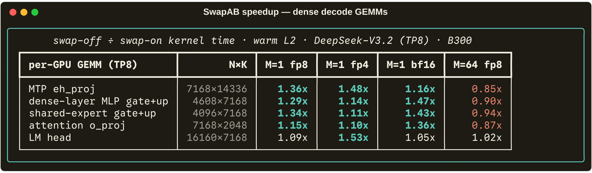
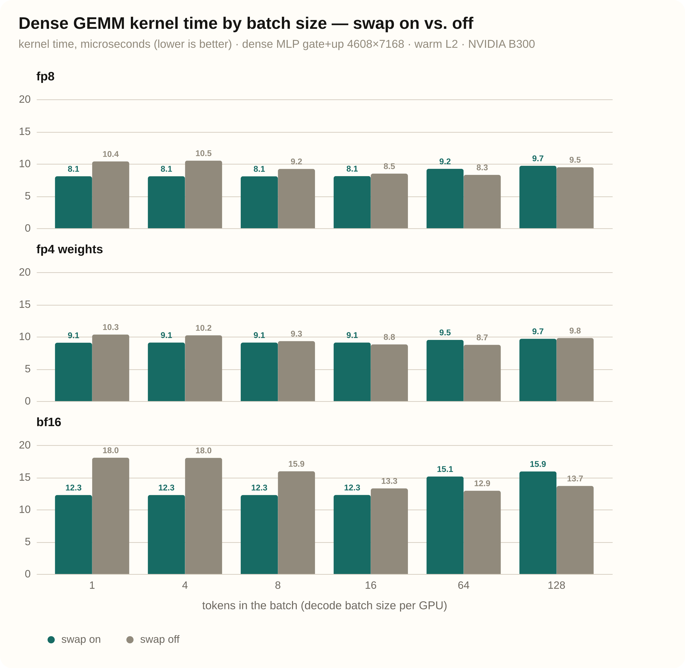
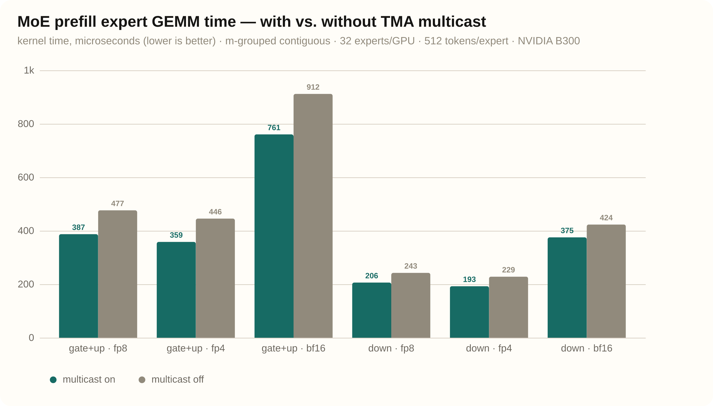

# deepgemm-swapab-bench

SwapAB is a GEMM trick. Instead of computing `C = A·B`, you compute
`Cᵀ = Bᵀ·Aᵀ`. Same math, same answer, operands flipped.

On paper this changes nothing. On an NVIDIA B300 (Blackwell, SM100) it is one
of the most important tricks in
[DeepGEMM](https://github.com/sgl-project/DeepGEMM) — and for MoE it is not
even a trick. It is a requirement.

This repo measures what SwapAB is worth on the real GEMM shapes that
[DeepSeek-V3.2](https://huggingface.co/deepseek-ai/DeepSeek-V3.2) serving
runs, in FP8, FP4-weight, and BF16. Every number was measured on a B300 with
CUPTI hardware counters. Every configuration was checked against a reference
matmul before it was timed. Nothing is estimated.

<p align="center"></p>
<p align="center"><em>How much faster the swapped kernel is at batch size 1 — and how it flips past batch 64.</em></p>

<p align="center"></p>
<p align="center"><em>Absolute kernel time, one panel per dtype. The swapped kernel is flat from 1 to 16 tokens in every dtype; the plain kernel only catches up once the batch is big. The gap is largest in bf16.</em></p>

## The three results

**1. For MoE GEMMs on SM100, SwapAB is mandatory.** DeepGEMM hard-codes it for
every m-grouped GEMM. We patched the code to force it off anyway. The masked
layout returns wrong answers. The contiguous layout has no legal configuration
at all.

<p align="center"></p>
<p align="center"><em>What happens when you force the swap off on grouped GEMMs. Every dtype, same story.</em></p>

**2. For dense decode GEMMs, SwapAB is worth up to 1.5x — when the weights are
in cache.** At batch sizes 1–16 the heuristic picks the swap on almost every
DeepSeek-V3.2 shape. With weights resident in L2 it wins up to 1.53x. With a
cold L2 (the realistic decode case) both variants wait on HBM and tie.

**3. TMA multicast — which only works in the swapped layout — cuts MoE prefill
time by up to 19%.** At decode sizes it does nothing.

<p align="center"></p>
<p align="center"><em>MoE prefill expert GEMMs, with and without multicast. Only the swapped layout can multicast at all.</em></p>

## What SwapAB is

Start with the decode GEMM. If you squint, it looks like this:

- **A** is the activations: a few rows. One row per token in the batch. At
  decode time that is 1 to 16 rows.
- **B** is the weights: thousands of rows.

On an ideal GPU, A and B would be treated the same, and nobody would care
which one you call "A". On SM100 they are not treated the same. Three pieces
of hardware care a lot: the tensor core, its accumulator memory, and TMA.

## Why the hardware cares

Blackwell's matrix instruction is `tcgen05.mma` (CUTLASS calls it **UMMA**).
It reads A and B tiles from shared memory and accumulates into **TMEM** — a
dedicated 256 KB memory on every SM, laid out as **128 lanes (rows) ×
columns**.

Here is the catch:

- The instruction's **M side maps to TMEM lanes. It is rigid**: 128 per CTA
  (256 for a 2-CTA pair).
- The instruction's **N side maps to TMEM columns. It is flexible**: any
  multiple of 16, up to 256.

The kernel's own assert says it plainly
([`sm100_fp8_fp4_gemm_1d1d.cuh:297`](https://github.com/sgl-project/DeepGEMM/blob/a348cd95a8ddfd3ef337b595d8e8b841c0d9cf0f/deep_gemm/include/deep_gemm/impls/sm100_fp8_fp4_gemm_1d1d.cuh#L297-L299)):

```c++
DG_STATIC_ASSERT((UMMA_M == 64  and UMMA_N %  8 == 0 and  8 <= UMMA_N and UMMA_N <= 256) or
                 (UMMA_M == 128 and UMMA_N % 16 == 0 and 16 <= UMMA_N and UMMA_N <= 256) or
                 (UMMA_M == 256 and UMMA_N % 16 == 0 and 16 <= UMMA_N and UMMA_N <= 256),
                 "Invalid MMA instruction shape");
```

Now put the decode GEMM on this machine, without the swap. Your 1–16 token
rows land on the rigid M side. The instruction still spans 128 TMEM lanes. At
M=16, you light up 16 lanes out of 128. The tensor core does 8x the useful
work.

Your M is too small. Your N is fine. So swap them.

With SwapAB, the kernel computes `Bᵀ·Aᵀ`. The weight dimension (thousands)
now sits on the rigid 128-lane side and fills it completely. The token count
sits on the flexible side as `UMMA_N`
([`:50-51`](https://github.com/sgl-project/DeepGEMM/blob/a348cd95a8ddfd3ef337b595d8e8b841c0d9cf0f/deep_gemm/include/deep_gemm/impls/sm100_fp8_fp4_gemm_1d1d.cuh#L50-L51)):

```c++
constexpr uint32_t UMMA_M = LAYOUT_AD_M * kNumMulticast;   // rigid: 128, or 256 for 2-SM
constexpr uint32_t UMMA_N = kSwapAB ? BLOCK_M : BLOCK_N;   // flexible, steps of 16
```

The kernel even re-sizes `UMMA_N` per block to the real number of tokens
([`:329-331`](https://github.com/sgl-project/DeepGEMM/blob/a348cd95a8ddfd3ef337b595d8e8b841c0d9cf0f/deep_gemm/include/deep_gemm/impls/sm100_fp8_fp4_gemm_1d1d.cuh#L329-L331)).
7 tokens? `UMMA_N = 16`, the minimum step. The waste drops from 8x to about
2x.

## What actually flips

SwapAB is not "swap two pointers". Five things change. Step by step:

**Step 1 — the heuristic decides.** For dense GEMMs, DeepGEMM tries layouts
with and without the swap and scores them
([`sm100.hpp:47`](https://github.com/sgl-project/DeepGEMM/blob/a348cd95a8ddfd3ef337b595d8e8b841c0d9cf0f/csrc/jit_kernels/heuristics/sm100.hpp#L47)).
For m-grouped GEMMs it does not even look at the alternative
([`sm100.hpp:31`](https://github.com/sgl-project/DeepGEMM/blob/a348cd95a8ddfd3ef337b595d8e8b841c0d9cf0f/csrc/jit_kernels/heuristics/sm100.hpp#L31-L43)):

```c++
// Always enable swap A/B (and multicasting if possible) for m-grouped GEMMs
if (desc.gemm_type == GemmType::MGroupedContiguous or ...) {
    const bool swap_ab = true;
```

**Step 2 — the instruction descriptor flips.** Data types and majorness swap
places ([`:283-286`](https://github.com/sgl-project/DeepGEMM/blob/a348cd95a8ddfd3ef337b595d8e8b841c0d9cf0f/deep_gemm/include/deep_gemm/impls/sm100_fp8_fp4_gemm_1d1d.cuh#L283-L286)).
This is why the FP4 recipe works: the FP4 operand is the weights, and after
the swap the descriptor must present them as operand A.

```c++
auto instr_desc = kSwapAB ? cute::UMMA::make_instr_desc_block_scaled<b_dtype_t, a_dtype_t, ..., kMajorB, kMajorA>()
                          : cute::UMMA::make_instr_desc_block_scaled<a_dtype_t, b_dtype_t, ..., kMajorA, kMajorB>();
```

**Step 3 — the MMA is issued backwards.** B still lands in `smem_b`. But at
issue time, B's shared-memory descriptor goes into the A slot, and the
scale-factor TMEM columns swap with their operands
([`:375-386`](https://github.com/sgl-project/DeepGEMM/blob/a348cd95a8ddfd3ef337b595d8e8b841c0d9cf0f/deep_gemm/include/deep_gemm/impls/sm100_fp8_fp4_gemm_1d1d.cuh#L375-L386)):

```c++
if constexpr (kSwapAB) {
    mma_t::fma(b_desc, a_desc, ...);   // B is fed as operand A
}
```

From this point on, TMEM is accumulating **Cᵀ**, not C.

**Step 4 — the epilogue un-transposes.** You need C in global memory, but
TMEM holds Cᵀ, and there is no TMA path out of TMEM at all. TMA stores read
from shared memory. The only way out of TMEM is `tcgen05.ld` into plain
registers. So the swapped epilogue
([`sm100_store_cd_swap_ab.cuh`](https://github.com/sgl-project/DeepGEMM/blob/a348cd95a8ddfd3ef337b595d8e8b841c0d9cf0f/deep_gemm/include/deep_gemm/epilogue/sm100_store_cd_swap_ab.cuh))
takes the long road:

```text
TMEM --tcgen05.ld--> registers --stmatrix.trans--> SMEM --TMA store--> GMEM
 (Cᵀ)                (transposed tile)            (C, fixed)          (C)
```

The transpose happens during the store to shared memory, with the
transposing form of `stmatrix`. The FP32 accumulators are packed to BF16 on
the way:

```c++
ptx::SM90_U32x4_STSM_T<int>::copy(
    math::cast_into_bf16_and_pack(values[0], values[1]), ..., smem_ptr);
```

which is exactly this PTX instruction:

```ptx
stmatrix.sync.aligned.x4.m8n8.shared.b16.trans [%0], {%1, %2, %3, %4};
```

`.trans` transposes each 8×8 tile as it writes. After that, a normal TMA
store pushes C to global memory. This detour is the *cost* of SwapAB.

**Step 5 — the cluster axis moves, and multicast comes along.** The
heuristic ties the CTA-cluster direction to the swap: swapped layouts may
only pair CTAs along N, plain layouts only along M
([`sm100.hpp:76-88`](https://github.com/sgl-project/DeepGEMM/blob/a348cd95a8ddfd3ef337b595d8e8b841c0d9cf0f/csrc/jit_kernels/heuristics/sm100.hpp#L76-L88)).
In the swapped kernel, the paired CTAs share the token tile: each loads half
of it and TMA-multicasts its half to its partner, while streaming its own
private slab of weights.

Why this matters for MoE: a grouped GEMM's per-expert token count is tiny at
decode time. There are never two M blocks to pair on. The only dimension with
enough blocks to pair on is N — and pairing on N is exactly what the swapped
layout allows. No swap, no multicast.

## The shapes we measured

We did not guess the shapes. We read them out of the DeepSeek-V3.2 checkpoint
itself — [`bench/inspect_st_headers.py`](bench/inspect_st_headers.py) fetches
just the safetensors shard headers over HTTP range requests, no weight
download. Then we sharded them the way sglang does at TP8/EP8
(`models/deepseek_v2.py`, `layers/attention/dsa/dsa_indexer.py`).

M is the number of tokens in the batch. Decode M = per-GPU batch size — the
1–16 regime SwapAB exists for.

| GEMM (per GPU, TP8) | N×K | serving dtype | comes from |
|---|---|---|---|
| fused q_a + kv_a | 2112×7168 | fp8 | `q_a_proj [1536,7168]` + `kv_a_proj_with_mqa [576,7168]`, replicated |
| `q_b_proj` | 3072×1536 | fp8 | `[24576,1536]` column-parallel ÷8 |
| `o_proj` | 7168×2048 | fp8 | `[7168,16384]` row-parallel ÷8 |
| DSA indexer `wq_b` | 8192×1536 | fp8 | `[8192,1536]`, replicated |
| DSA indexer `wk`+`weights_proj` | 192×7168 | bf16 | `[128,7168]` + `[64,7168]`, fused by sglang |
| dense-layer MLP gate+up | 4608×7168 | fp8 | 2× `[18432,7168]` merged ÷8 (layers 0-2) |
| dense-layer MLP down | 7168×2304 | fp8 | `[7168,18432]` ÷8 |
| shared-expert gate+up | 4096×7168 | fp8 | 2× `[2048,7168]` merged |
| `kv_b_proj` (prefill path) | 4096×512 | fp8 | `[32768,512]` ÷8 |
| LM head | 16160×7168 | bf16 | `[129280,7168]` ÷8 |
| MTP `eh_proj` | 7168×14336 | bf16 | layer 61 `[7168,14336]` |
| MoE experts (EP8, 32 groups) | gate+up 4096×7168 · down 7168×2048 | fp8 | 256× `[2048,7168]` / `[7168,2048]` |

The FP8 recipe is the checkpoint's own: 128×128 weight blocks, UE8M0 scales.
The FP4 recipe is DeepGEMM's SM100 path: FP8 activations × packed-e2m1
weights with 1×32 UE8M0 scales. BF16 uses the no-scale kernel. All three run
through the same swap machinery.

## How we measured

Step by step:

1. **Patch DeepGEMM** with two env knobs
   ([`patches/`](patches/)): `DG_FORCE_SWAP_AB=0|1` filters the layout
   candidates by swap mode, `DG_FORCE_MULTICAST=0|1` filters by cluster size.
   The knobs are read fresh on every call, so one process measures every
   mode. Everything else — comparator, kernels, epilogues — is stock
   `sgl-project/DeepGEMM @ a348cd9`.
2. **Build inputs at each real shape**, quantized exactly as serving does.
   Scale factors are pre-packed outside the timed call, the same way sglang
   packs them at load time. We verified with the torch profiler that each
   timed call launches exactly one kernel.
3. **Check correctness first.** Every (shape, M, dtype, mode) is compared
   against a float32 matmul before it is timed. Anything that fails is
   recorded and never timed.
4. **Time with CUPTI**, not wall clocks:
   `flashinfer.testing.utils.bench_gpu_time_with_cupti` with
   `use_cuda_graph=True`. One captured call, replayed 30 times after 10
   warmups, median reported. The L2 flush happens outside the measured
   window.

> [!NOTE]
> **Cold vs. warm L2 matters.** Our primary numbers flush the L2 before
> every replay. That is what decode really looks like: a layer's weights get
> evicted between uses. The warm-L2 pass (weights resident) isolates the
> compute-side effect — that is where SwapAB's dense win shows up.

Full CSVs and complete logs, including every layout the JIT picked, are in
[`logs/`](logs/).

## Result 1: MoE grouped GEMMs only work swapped

We forced the swap off on the m-grouped GEMMs. Two different failures:

- **Masked layout (decode):** compiles, runs, and returns wrong answers —
  relative error ≈ 0.5, on every dtype. The grouped scheduler's effective-M
  logic exists "for swap A/B and psum layout only"
  ([`scheduler/gemm.cuh:162`](https://github.com/sgl-project/DeepGEMM/blob/a348cd95a8ddfd3ef337b595d8e8b841c0d9cf0f/deep_gemm/include/deep_gemm/scheduler/gemm.cuh#L162)).
- **Contiguous layout (prefill):** no legal layout exists. DeepGEMM aligns
  group boundaries to 240 rows. 240 is a multiple of the 16-row UMMA-N step —
  the swapped granularity — and divisible by none of the plain kernel's
  BLOCK_M choices (32, 64, 128). The memory format itself is swap-native.

> [!IMPORTANT]
> The MoE expert GEMMs are where most of DeepSeek-V3.2's FLOPs go. For them,
> SwapAB is not a 10% optimization. It is the assumption the whole SM100
> grouped-GEMM design is built on.

## Result 2: dense decode GEMMs, up to 1.5x — sometimes

Warm L2, kernel time in µs, swap-on / swap-off, ratio in parens:

| shape | M=1 | M=8 | M=64 |
|---|---:|---:|---:|
| MTP `eh_proj` | 17.5 / 23.8 (**1.36x**) | 18.7 / 21.3 (1.14x) | 22.4 / 19.1 (0.85x) |
| dense MLP gate+up | 8.1 / 10.4 (**1.29x**) | 8.1 / 9.2 (1.14x) | 9.2 / 8.3 (0.90x) |
| `o_proj` | 5.0 / 5.7 (1.15x) | 4.8 / 5.4 (1.11x) | 5.3 / 4.6 (0.87x) |
| indexer `wq_b` | 4.4 / 5.0 (1.12x) | 4.4 / 4.7 (1.07x) | 4.8 / 4.1 (0.86x) |
| LM head | 20.2 / 22.0 (1.09x) | 20.5 / 21.1 (1.03x) | 21.6 / 22.1 (1.02x) |

FP4 pushes further where compute is cheapest per byte: LM head at M=1 is
9.9 / 15.3 µs = **1.53x**. BF16 shows the same shape: dense MLP gate+up at
M=1 is 12.3 / 18.0 µs = **1.47x**.

Three things to read off this table:

1. **Small M wins.** At 1–16 tokens the swap is worth 1.1–1.5x.
2. **It flips.** Past M≈32 the swapped layout starts losing. That is exactly
   where the heuristic changes its choice.
3. **Cold L2 hides it.** With weights streaming from HBM, both variants are
   memory-bound and land at 0.94–1.05x of each other. The swap costs
   nothing — it just cannot help when DRAM is the wall.

## Result 3: multicast, and a bonus

Multicast only exists in the swapped layout (Step 5 above). On MoE prefill
(contiguous, 512 tokens per expert) it is worth 13–24% depending on shape and
dtype — the exact times are in the bar chart at the top. At decode sizes
(1–32 tokens per expert) it is neutral.

Bonus from the same runs — decode MoE (masked, 8 tokens per expert, cold L2):

| | gate+up | down |
|---|---:|---:|
| fp8 | 160.5 µs | 90.7 µs |
| fp4 weights | 96.0 µs | 55.2 µs |

FP4 weights are ≈ **1.65x** faster than FP8 here. Decode MoE is
weight-streaming-bound, and half the bytes means nearly half the time.

## Run it yourself

```bash
git clone https://github.com/vincentzed/deepgemm-swapab-bench
cd deepgemm-swapab-bench
./run.sh   # clones the fork @ a348cd9, applies the patch, builds, runs all sweeps
```

You need: an SM100-family GPU (we used one GPU of an 8×B300 box), a CUDA 13
container with torch + flashinfer (we used `lmsysorg/sglang:nightly-dev-cu13`),
and `pip install cupti-python`.

To regenerate the figures from the logs:

```bash
uv run scripts/make_visuals.py   # terminal-style panels (rich -> SVG)
uv run scripts/make_plots.py     # bar charts (vega-lite via vl-convert)
./scripts/svg_to_png.sh          # SVG -> PNG (headless Chromium)
```

> [!WARNING]
> The patch in `patches/` is a measurement instrument. It exists so a
> benchmark can force both sides of the comparison. Do not ship it: as the
> results above show, the forced-off grouped path returns wrong answers.

## Repo layout

```text
bench/
  shapes.py             # the shape catalog, with per-tensor provenance
  bench_swapab.py       # CUPTI harness: dense/masked/contiguous x fp8/fp4/bf16 x modes
  probe_auto_choice.py  # records which layout the unpatched heuristic picks
  inspect_st_headers.py # reads tensor shapes from safetensors headers, no download
scripts/
  make_visuals.py       # terminal-style panels (rich)
  make_plots.py         # bar charts (vega-lite)
  thread_visuals.py     # vendored plot helpers (vincentzed/my-skills)
  svg_to_png.sh         # SVG -> PNG
patches/
  0001-dg-force-swap-ab-multicast-knobs.patch
logs/                   # every CSV and full stdout from the runs above
media/                  # the four figures
run.sh
```

Code facts were verified line-by-line against
[sgl-project/DeepGEMM](https://github.com/sgl-project/DeepGEMM) @ `a348cd9`
(links throughout). Shapes come from the
[DeepSeek-V3.2](https://huggingface.co/deepseek-ai/DeepSeek-V3.2) checkpoint
headers and [sglang](https://github.com/sgl-project/sglang)'s sharding code.
Instruction behavior per the
[NVIDIA PTX ISA](https://docs.nvidia.com/cuda/parallel-thread-execution/)
(`tcgen05.mma`, `tcgen05.ld`, `stmatrix`, TMA).

## License

MIT. DeepGEMM itself is MIT-licensed by its authors.
